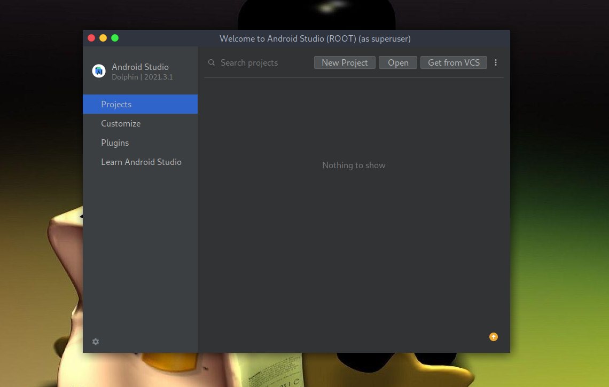
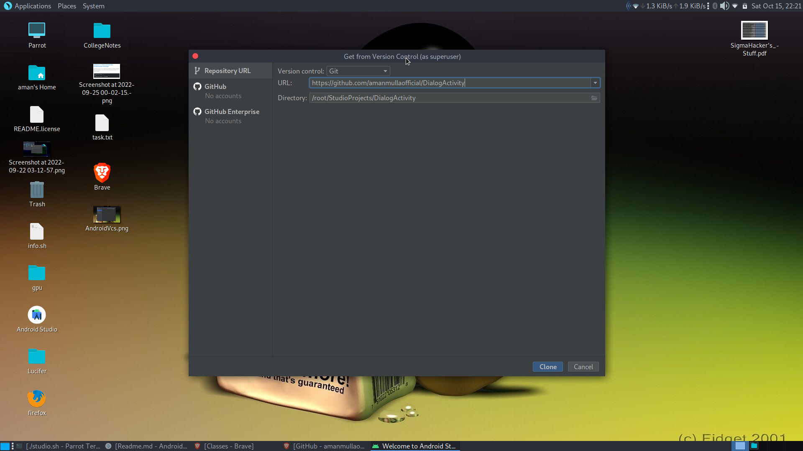
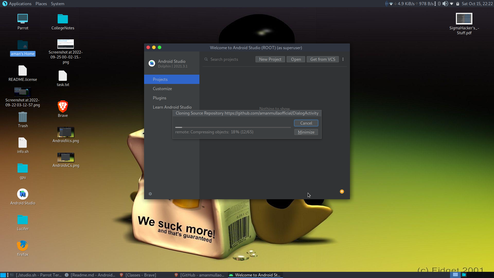

# How to clone a github project into Android Studio using VCS ?
**Answer** >>
>
Android Studio provides a platform where one can build apps for Android phones, tablets, Android Wear, Android TV, and Android Auto. Android Studio is the official IDE for Android application development, based on IntelliJ IDEA. One can develop Android Applications using Kotlin or Java as the Backend Language, and it provides XML for developing Frontend Screens. 

*Step 1:*
```Open your Android Studio then go to Get from VCS as shown in the below image.```



*Step 2:*
```
After clicking on the Project from VCS a pop-up screen will arise like below. In the Version control choose Git from the drop-down menu.
```



*Step 3:*
```
Then at last paste the link in the URL and choose your Directory. Click on the Clone button and you are done.
```


